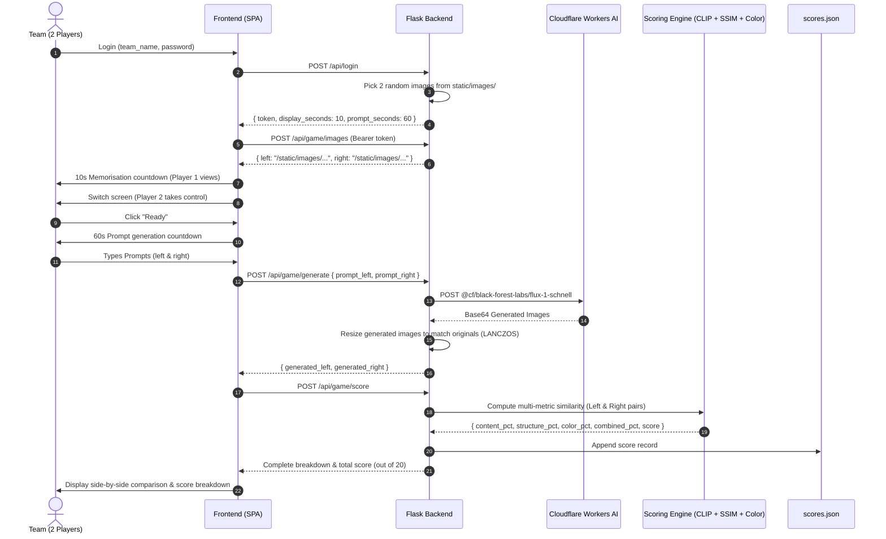

# Memory to Image — Game Architecture & Scoring Documentation

---

## 1. Overview & Game Flow

The **Memory to Image** challenge is a paired cooperative memory and prompt engineering event. Teams work in pairs where visual recall and verbal communication are tested under tight time constraints.

### End-to-End Workflow Diagram

---

## 2. Image Resolution & Dimension Matching

To maintain fair comparison and prevent geometric distortion during scoring and UI presentation, generated images are synchronized with the originals.

1. **Generation:** Cloudflare Workers AI outputs a high-resolution base64 PNG.
2. **Dimension Sync:** The backend opens the original image $I_{\text{orig}} \in \mathbb{R}^{W \times H \times 3}$ and the generated image $I_{\text{gen}}$. If $\text{dim}(I_{\text{gen}}) \neq \text{dim}(I_{\text{orig}})$, $I_{\text{gen}}$ is resampled:
   $$I_{\text{gen}} \leftarrow \text{Resize}\Big(I_{\text{gen}}, (W, H), \text{filter}=\text{LANCZOS}\Big)$$
3. **Display Constraints:** Both images share CSS aspect ratio rules (`object-fit: cover`), ensuring side-by-side consistency.

---

## 3. Mathematical Scoring Engine

The scoring system evaluates similarity across three distinct dimensions: **Semantic Content**, **Spatial Structure**, and **Color Distribution**.

### Metric 1: Semantic Content Score ($S_{\text{content}}$) via CLIP

CLIP (`openai/clip-vit-base-patch32`) projects both the original image $I_1$ and generated image $I_2$ into a shared 512-dimensional embedding space:

$$\mathbf{e}_1 = f_{\text{vision}}(I_1), \quad \mathbf{e}_2 = f_{\text{vision}}(I_2) \quad \in \mathbb{R}^{512}$$

Vectors are normalized using the Euclidean norm ($\ell_2$-norm):

$$\hat{\mathbf{e}}_1 = \frac{\mathbf{e}_1}{\|\mathbf{e}_1\|_2}, \quad \hat{\mathbf{e}}_2 = \frac{\mathbf{e}_2}{\|\mathbf{e}_2\|_2}$$

The cosine similarity is computed as the dot product:

$$S_{\text{content}} = \max\left(0, \min\left(1, \hat{\mathbf{e}}_1 \cdot \hat{\mathbf{e}}_2\right)\right)$$

- **Evaluates:** Presence of core objects, environment, and concepts.
- **Invariant to:** Small position shifts and slight color variations.

---

### Metric 2: Structural Similarity Score ($S_{\text{struct}}$) via SSIM

Images are downsampled to $256 \times 256$ grayscale matrices $x, y \in \mathbb{R}^{256 \times 256}$ with pixel intensities in $[0, 1]$.

SSIM assesses luminance, contrast, and structure over local window regions:

$$\text{SSIM}(x, y) = \frac{(2\mu_x\mu_y + c_1)(2\sigma_{xy} + c_2)}{(\mu_x^2 + \mu_y^2 + c_1)(\sigma_x^2 + \sigma_y^2 + c_2)}$$

Where:
- $\mu_x, \mu_y$: Local mean pixel intensities.
- $\sigma_x^2, \sigma_y^2$: Local variances.
- $\sigma_{xy}$: Local covariance between $x$ and $y$.
- $c_1 = (k_1 L)^2, c_2 = (k_2 L)^2$: Regularization constants ($L=1.0$, $k_1=0.01$, $k_2=0.03$).

The score is clamped:

$$S_{\text{struct}} = \max\Big(0, \min\Big(1, \text{SSIM}(x, y)\Big)\Big)$$

- **Evaluates:** Object placement, orientation, sizing, scale, and composition balance.

---

### Metric 3: Color Tone & Palette Score ($S_{\text{color}}$) via HSV Correlation

Both images are resized to $256 \times 256 \times 3$ and transformed from RGB to the Cylindrical HSV color space:

$$\text{Hue } H \in [0, 1], \quad \text{Saturation } S \in [0, 1], \quad \text{Value } V \in [0, 1]$$

For each channel $k \in \{H, S, V\}$, a 32-bin histogram $h_{k, 1}$ and $h_{k, 2}$ is computed. The Pearson histogram correlation is:

$$r_k = \frac{\sum_{i=1}^{B} (h_{k, 1}(i) - \bar{h}_{k, 1})(h_{k, 2}(i) - \bar{h}_{k, 2})}{\sqrt{\sum_{i=1}^{B} (h_{k, 1}(i) - \bar{h}_{k, 1})^2 \cdot \sum_{i=1}^{B} (h_{k, 2}(i) - \bar{h}_{k, 2})^2}}$$

The channels are weighted to prioritize Hue (color identity) over brightness:

$$r_{\text{combined}} = 0.45 \cdot r_H + 0.25 \cdot r_S + 0.30 \cdot r_V$$

Mapped from $[-1, 1]$ to $[0, 1]$:

$$S_{\text{color}} = \max\left(0, \min\left(1, \frac{r_{\text{combined}} + 1}{2}\right)\right)$$

- **Evaluates:** Mood, lighting warmth/coolness, and color accuracy.

---

## 4. Combined Similarity & Final Score Computation

### Weighted Aggregation
For each image pair (Left and Right independently):

$$S_{\text{combined}} = w_c \cdot S_{\text{content}} + w_s \cdot S_{\text{struct}} + w_{\text{col}} \cdot S_{\text{color}}$$

$$\text{Where } w_c = 0.40, \quad w_s = 0.35, \quad w_{\text{col}} = 0.25 \quad \left(\sum w = 1.0\right)$$

### Linear Mapping to Discrete Points (0–10)
Natural image generations with varied styles typically produce combined scores in the empirical interval $[S_{\min}, S_{\max}] = [0.25, 0.85]$.

$$\text{Raw Score} = \frac{S_{\text{combined}} - 0.25}{0.85 - 0.25} \times 10$$

$$\text{Score}_{\text{image}} = \text{clamp}\Big(\text{round}(\text{Raw Score}), 0, 10\Big)$$

### Team Total Score (0–20)

$$\text{Total Score} = \text{Score}_{\text{Left}} + \text{Score}_{\text{Right}} \quad \in [0, 20]$$

---

## 5. Summary Table of Metrics

| Metric | Algorithm / Model | Weight | Focus Area |
| :--- | :--- | :---: | :--- |
| **Content** | CLIP ViT-B/32 Cosine Similarity | **40%** | Object types, setting, semantic context |
| **Structure** | Grayscale SSIM ($256 \times 256$) | **35%** | Composition, scale, orientation, layout |
| **Color** | HSV Histogram Pearson Correlation | **25%** | Color palette, lighting atmosphere, tone |
